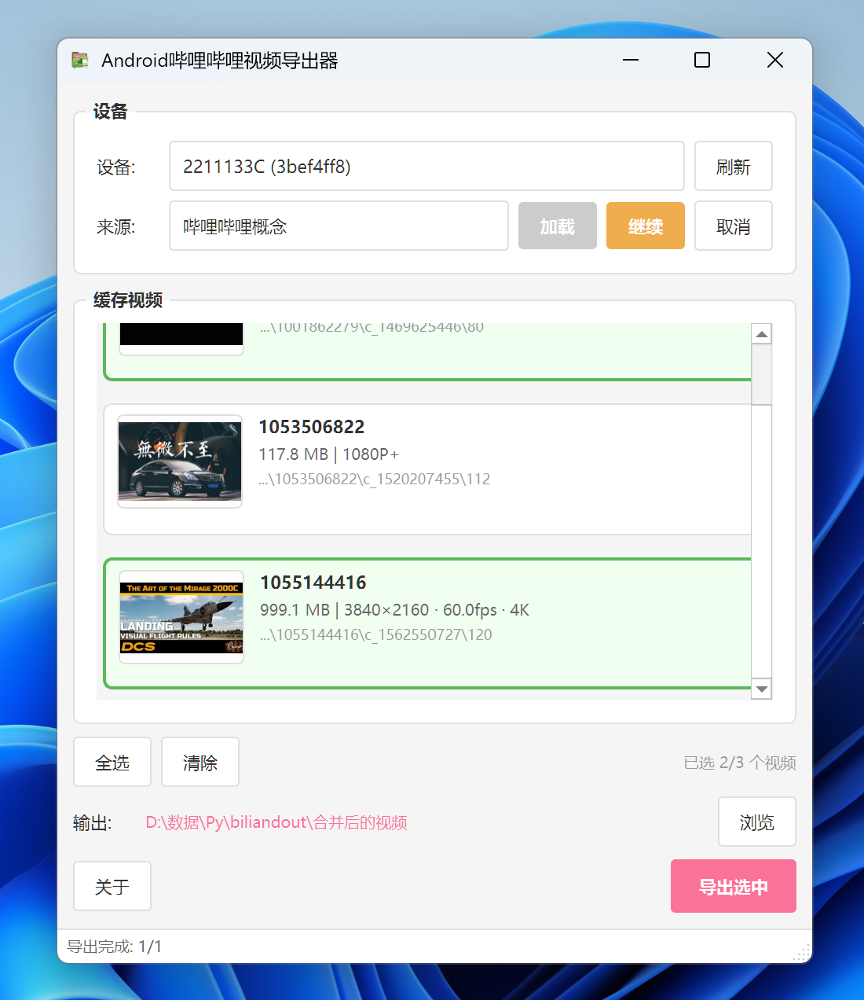

# Android哔哩哔哩视频导出器(`biliandout`)

  

**Android哔哩哔哩视频导出器**是一个`PyQT` ***Windows桌面端图形应用(使用`pyinstaller`打包)***, **可自动读取连接至计算机的Android设备上的哔哩哔哩缓存视频, 并导出为`.mp4`, 开箱即用.** 

> 遵循`GPL v3`协议, 开源于[GitHub](https://github.com/Water-Run/biliandout)  

> 项目封装了[biliffm4s](https://github.com/Water-Run/-m4s-Python-biliffm4s), 其本身也为对`ffmpeg`的封装  

  

## 如何安装

1. 从[Release]()下载`biliandout.zip`  
2. 解压至合适目录, 运行`Android哔哩哔哩视频导出器.exe`. 由于采用单文件封装, 初次打开消耗一些时间是正常的  

你也可以从源码中自行构建: 在此文档目录下运行`python build.py`即可. 会自动完成打包输出至`_release`目录中.  

## 如何使用  

1. Android设备上启用USB调试(在开发者选项中), 并使用数据线连接至计算机. 选择USB文件传输模式  
2. 打开应用, 选定你的设备和对应的哔哩哔哩版本, 点击扫描并载入  
3. 等待载入完成. 选取要导出的视频, 点击导出按钮, 等待缓存视频输出至对应目录  
